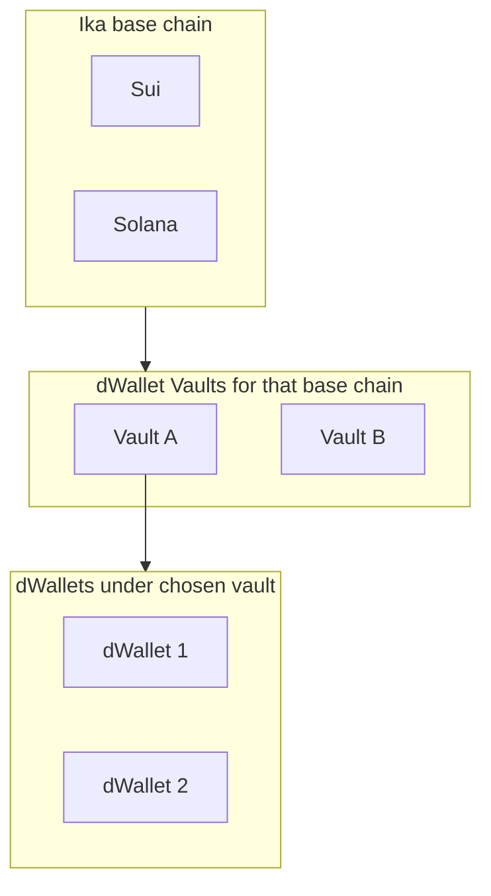

# Chromatika terminology

Canonical definitions for product copy, support, and engineering. Keep UI and docs aligned with this file. For how these pieces fit together over time, see [`DWALLET_VAULT_MODEL.md`](DWALLET_VAULT_MODEL.md).

## Hierarchy (target product model)

Ika base chain preference scopes which network anchors ika objects. Under each base chain, the user may have **multiple dWallet Vaults** (owner identities). Each dWallet Vault holds **zero or more dWallets** (ika MPC wallets).

## Core terms

| Term | Definition |
|------|------------|
| **Ika base chain** / **base chain** (ika context) | **Sui** or **Solana**: the chain where ika anchors a given dWallet (Sui object id vs Solana PDA). In code: `BaseChain`, `DWalletMeta.baseChain`. **Solana (ika) pre-alpha** is devnet-only mock signing, not production MPC — disclaimer surfaces in the root README and on every Solana ika UI surface. |
| **Ika base mode** | Global UI preference (`chromatika_ika_base_mode_v1`) for which base chain the wallet emphasizes for new flows. Not the same as per–dWallet `baseChain`, but should stay consistent as the product matures. |
| **dWallet Vault** | The **owner wallet** for a given ika base chain: the identity that funds ika transactions and **owns** dWallet records on-chain. Created from a new mnemonic, or imported (mnemonic, private key, hardware, dWallet-anchored). **Not** an ika dWallet itself. **No** OAuth / zkLogin vault in Chromatika. |
| **dWallet** | The **ika MPC wallet** (2PC): canonical identity for dapp connections, signing, and user-visible addresses on supported chains, per product rules in the README. |
| **Chromatika vault** | The **local encrypted store** (AES-256-GCM + Argon2id RFC 9106 §4 option 2) unlocked with the **app password**. Holds **multiple** dWallet Vault records (`chromatika_vault_v3`). In code: `encryptVault` / `VAULT_KEY` in `wallet-service.ts`. **Do not** call this "vault" alone in user-facing copy without qualification. |
| **Fee payer** / **HD key** | Mnemonic-derived keys used for **gas and infrastructure** (e.g. Sui fee payer) where distinct from the dWallet identity. Users should not treat these as their primary “wallet” for dapps. |

## Usage rules

- Never use **Vault** alone in UX. Prefer **dWallet Vault** (owner keyring) vs **Chromatika vault** (encrypted backup / app lock).
- **Wallet** in casual copy often means the whole extension or “my money”; in spec text prefer **dWallet** or **dWallet Vault** as above.
- **Chain** without context is ambiguous (EVM chain id vs ika base chain). Say **ika base chain**, **EVM network**, **Sui network**, etc.

## Related docs

- [`DWALLET_VAULT_MODEL.md`](DWALLET_VAULT_MODEL.md) - current implementation vs target model, phased rollout.
- [`../README.md`](../README.md) - product identity rules.
- [`architecture-final.html`](architecture-final.html) - locked architecture diagram.
